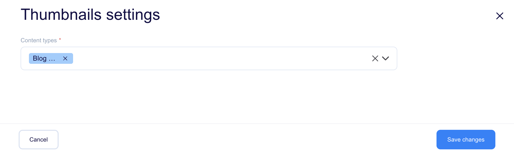

<a href="https://flotiq.com/">
    
</a>

# About plugin

This plugin generates thumbnails instead of simple link icons on object grids. Thumbnails are clickable and after clicking, a modal with a bigger version is shown.

## Plugin outcome

The thumbnail is visible in the grid:


And after clicking on it the modal is visible:


You can open the full image by clicking the blue arrow in the modal.

## Configuring plugin

To manage a plugin, you must first add it to your plugins. Click the "+" icon to add the plugin to your library and click the "Manage" button. It will open the plugin settings.



Field descriptions:

* `Content Type` - Defines the type of objects for which the thumbnails will be generated.

# Development

## Quick start

1. `yarn` - to install dependencies
2. `yarn start` - to start development mode - rebuild on file modifications
3. update your `plugin-manifest.json` file to contain the production URL and other plugin information
4. `yarn build` - to build plugins

## Dev environment

Dev environment is configured to use:

* `prettier` - best used with automatic format on save in IDE
* `eslint` - it is built into both `start` and `build` commands

## Output

The plugins are built into a single `dist/index.js` file. The manifest is copied to `dist/plugin-manifest.json` file.

## Deployment

<!-- TO DO -->

## Loading the plugin

**Warning:** While developing, you can use  `https://localhost:3053/plugin-manifest.json` address to load the plugin manifest. Make sure your browser trusts the local certificate on the latter, to be able to use it e.g. with `https://editor.flotiq.com`

### URL

**Hint**: You can use localhost url from development mode `https://localhost:3053/index.js`

1. Open Flotiq editor
2. Open Chrome Dev console
3. Execute the following script
   ```javascript
   FlotiqPlugins.loadPlugin('plugin-id', '<URL TO COMPILED JS>')
   ```
4. Navigate to the view that is modified by the plugin

### Directly

1. Open Flotiq editor
2. Open Chrome Dev console
3. Paste the content of `dist/index.js` 
4. Navigate to the view that is modified by the plugin

### Deployment

**Hint**: You can use localhost url from development mode `https://localhost:3053/plugin-manifest.json`

1. Open Flotiq editor
2. Add a new plugin and paste the URL to the hosted `plugin-manifest.json` file
3. Navigate to the view that is modified by the plugin

## Collaborating

If you wish to talk with us about this project, feel free to hop on our [](https://discord.gg/FwXcHnX).

If you found a bug, please report it in [issues](https://github.com/flotiq/flotiq-ui-plugin-custom-links/issues).
